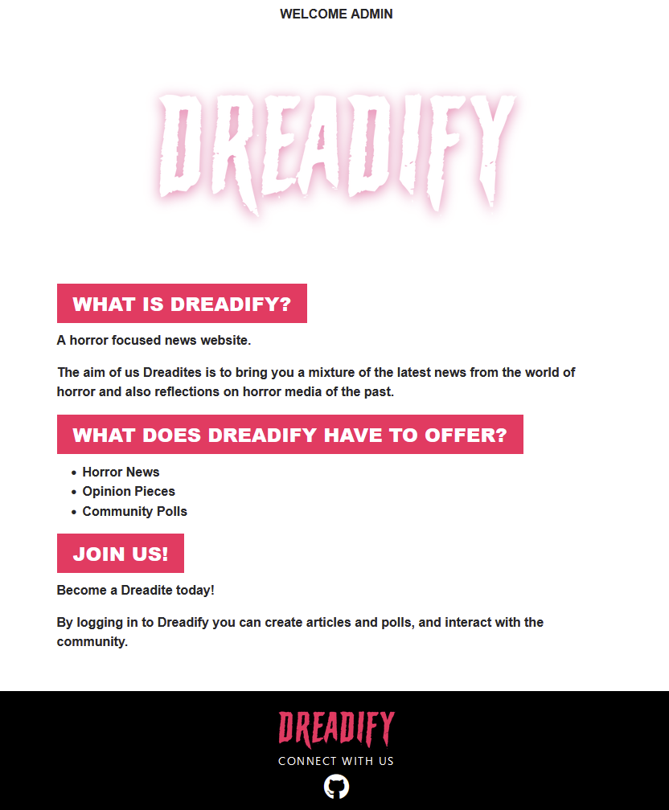
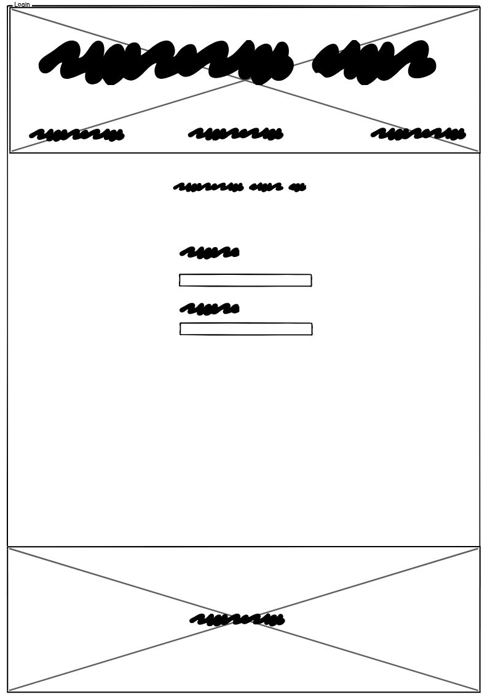

# **DREADIFY**

**Dreadify** is a **news website** that allows users to keep up to date with the latest news from the world of horror, while also contributing their own views and opinions. 

---

A *link* to the deployed website can be found [here](https://dreadify-68737d615b03.herokuapp.com/).

---

# Table of Contents

- [Dreadify](#dreadify)
- [Table Of Contents](#table-of-contents)
- [User Experience Design](#user-experience-design)
- [The Strategy Plane](#the-strategy-plane)
  - [Site Goals](#site-goals)
  - [Agile Planning](#agile-planning)
    - [Epics](#epics)
    - [User Stories](#user-stories)
  - [The Scope Plane](#the-scope-plane)
  - [The Structure Plane](#the-structure-plane)
    - [Features](#features)
    - [Future Features](#future-features)
  - [The Skeleton Plane](#the-skeleton-plane)
    - [Wireframes](#wireframes)
    - [Database](#database)
    - [Security](#security)
  - [The Surface Plane](#the-surface-plane)
    - [Design](#design)
    - [Colour Scheme](#colour-scheme)
    - [Typography](#typography)
    - [Imagery](#imagery)
    - [Technologies](#technologies)
    - [Testing](#testing)
    - [Deployment](#deployment)
    - [Version Control](#version-control)
    - [Heroku Deployment](#heroku-deployment)
    - [Run Locally](#run-locally)
- [Credits](#credits)

# User Experience Design

---

## Strategy Plane

---

### Site-Goals

The site is aimed to provide users with a platform to keep up to date with news and trends in horror genre and also let their own view be heard and discussed.

### Agile Planning

The project was developed using agile methodologies. There were 4 primary sprints, those being to do, in progress, review and done.

Epics were assigned to all tasks, prioritised using a labelling system. These indicate the importance of the task, while also keeping track of whether the task is optional or a must have. Priority was given to must haves, as they were essential to the completion of the project. All tasks were buillt from the perspective of my user stories, to ensure that all required features were being developed.

Two Kanban boards were used during the course of the project. [Trello](https://trello.com/b/bC6dUCx3/dreadify) was used to keep my resources together, and to give myself a simpler overview of my progress. A [GitHub Project](https://github.com/users/RyanFerris7/projects/2/views/1) was used to track progress more in-depth, and to track errors specifically as they arose. 

### Epics

This project was a complex task, and required epics to track progress. They are as follows:

#### EPIC 1 : SETUP & INITIAL DEPLOYMENT

Setting up the repository, installing django and the various plugins required and deploying to Heroku were covered in this step. Having all of this done in advance will allow more time to be spent focusing on getting functionality working.

#### EPIC 2: VIEWS, URLS & NAVIGATION

Setting up the basic navigation of the website and displaying the various views with correct url patterns. Getting the pages online and linked together would make testing features on individual pages easier, while also giving visible / tangible progress to see.

#### EPIC 3: AUTHENTICATION

Setting up user registration, login, account deletion and the login / register page. As the project hinges on its CRUD functionality, getting this in order would be an important step towards the final output.

#### EPIC 4: CRUD

Creating article & polls, Reading them, being able to Update and also Delete them. This is the important step of the project in terms of development, as it is the main criteria by which the project will be graded.

#### EPIC 5: STYLING

A functioning project is good, but it means little if the project’s design is inconsistent. This step willensure that users canunderstand how to navigate and use the website while also enjoying the process of using it.

#### EPIC 6: TESTING & VALIDATION

This epic covers the process of deploying the website, then taking the source code and validating it while also testing the project’s functionality. To ensure project functionality is vital.

#### EPIC 7: DOCUMENTATION

The final epic covers documentation, in particular the ReadMe file. It aims to deliver a high quality output by which to judge the project’s development cycle, explaining the steps taken throughout the process of building and deploying the website.

#### User Stories

#### EPIC 1 : SETUP & INITIAL DEPLOYMENT

As a developer, I must create the repository for the project on GitHub.

As a developer, I must create a Kanban board to track progress.

As a developer, I must setup my static file directory to serve images, css and js.

As a developer, I must connect Heroku to my project to deploy it.

As a developer, I must install Django for the basis of the project.

As a developer, I must setup the app in my IDE and organise my folder structure.

As a developer, I must setup ElephantSQL to host my database.

As a developer, I must connect Cloudinary to my project to host uploaded imagery.

####  EPIC 2: VIEWS, URLS & NAVIGATION

As a developer, I must create a base file that will be extended by various templates.

As a developer, I must create a 404 page in the event that a user tries to view a page that does not exist.

As a developer, I must create a page that informs users about the content and purpose of the website.

As a developer, I must create an easy to use navigation menu to access different views.

As a developer, I must create a footer that links back to the home page of the website and to any chosen social media platforms.

As a user, I want to view the latest horror news articles so that I can stay updated on recent developments in the genre.

As a user, I want to be able to filter by topic so that I can easily find information on specific subjects.

As a user, I want to be able to comment on articles o share my thoughts and engage in discussions with other readers.

#### EPIC 3: AUTHENTICATION

As a developer, I must implement a system and form for users to verify their identities and login to the website.

As a developer, I must implement systems to protect the data and content of users from malicicious individuals.

As a developer, I must make the process easy to understand and consistent with the rest of the website.

As a developer, I must inform specific users when a process has either succeeded or failed.

As a site owner, I want people to be able to register easily and comfortably while also being able to manage their data and delete it if they want.

#### EPIC 4: CRUD

As a developer, I must implement a system that allows users to create content for the website.

As a developer, I must implement a system by which the website can read and render user submitted content.

As a developer, I must implement a systeam for users that wish to update their content.

As a developer, I must implement a system that enables users to delete their content.

As a developer, I must implement a system that prevents users from altering or deleting other user’s content.

As a developer, I must implement a content warning that appears at first load to inform visitors of the nature of the website.

As a writer, I want to be able to create and publish articles and polls so that I can share my insights, opinions, and stories with the horror community.

As a writer, I want to be able to edit and update my articles after they've been published so that I can make corrections or add new information as needed.

As a writer, I want to be able to delete my account and anything that I have written.

As a writer, I want to be able to read and comment on content on the website.

#### EPIC 5: STYLING

As a developer, I must implement a design schem that is reflective of general theme of the website while also being eye-catching and well presented.

As a developer, I must choose a font to use that will allow content to be read easily.

As a developer, I must maintain the accessibility of the website during the process of styling it.

#### EPIC 6: TESTING & VALIDATION

As a developer, I must thoroughly test the functionality of every aspect of the website.

As a developer, I must ensure that every single piece of code passes validation.

#### EPIC 7: DOCUMENTATION

As a developer, I must complete a ReadMe file that encapsulates the process taken throughout the duration of the project.

As a developer, I must document the process of testing and validation. and delete it if they want.

---

## The Scope Plane 

Responsive design for screens as small as 320px.

CRUD functionality.

---

## The Structure Plane

### Features

---

**User Story - As a developer, I must create an easy to use navigation menu to access different views**

#### Nav Bar

The nav bar contains links to a sidebar, the homepage, a dropdown list of categories and either a login or logout option. These options are visible to all across all pages to ensure ease of navigation. It also scales, ensuring a comfortable viewing experience on all devices from 320px and upwards.

This is an early view of the navbar in development with a border to denote the shapes being used to build it.

This is a view of the nav mid way through development. I updated the design of the font to be more in keeping with the theme of the website.

This is a view of the navbar on the deployed project. The style of the header has changed, the category drop down has been implemented and the side bar has been added. More options are included in the sidebar to keep the nav bar tidy.

**User Story - As a user, I want to view the latest horror news articles so that I can stay updated on recent developments in the genre.**

#### Home Page

This is an early view of the home page. It features articles on the website and little to no styling.

This is a mid project view of the home page. Some style has been applied but layout issues are prominent. 

This is a view of the deployed home page. It features a clear outline of the website’s purpose, section headings, a carousel with shuffled articles, an ordered by most recent list of articles, and an ordered by most recent list of polls.

**User Story - As a developer, I must create a footer that links back to the home page of the website and to any chosen social media platforms.**

#### Footer

A footer is featured at the bottom of all pages of the website. It simply features a clickable logo to return to the home page, a call to action and a link to the github repo for this project.

**User Story - As a writer, I want to be able to create and publish articles and polls so that I can share my insights, opinions, and stories with the horror community.**

#### Create Article

This is an early view of the article creation page. It features an options to write a title, a slug (which would then be converted into a URL), an excerpt, an image url, an image uploader, a category selector, article content, and a post status selector.

This is a view of the deployed article creation page. The model was simplified for a better user experience with the url now being dynamically chosen and QuillForms being implemented to give users more control over how their work would be displayed. Users are returned to this page if they wish to edit something with the content being retrieved for their convenience.

#### Create Poll

This is an early view of the poll creation page. It features little styling but full functionality.

This is a view from the deployed poll creation page. The styling is now consistent with the rest of the website and the options are a little clearer. Users are returned to this page if they wish to edit something with the content being retrieved for their convenience.

**User Story - As a developer, I must create a page that informs users about the content and purpose of the website.**

#### About Page

This view from the deployed page contains an overview of the website and the process by which to contribute to it.

**User Story - As a writer, I want to be able to read and comment on content on the website.**

#### Article Page

This is an early view of the article page. It is unstyled, but features the content submitted by users as well as a comment section.

This is a view from the deployed website of the article page. It has been styled, and features the user submitted styling from Quill Forms. Careful consideration was given to the various elements of the website here to ensure that content remained legible and could distory the page itself.

**User Story - As a writer, I want to be able to delete my account and anything that I have written.**

#### Delete Page

This is a view from the deployed website for the delete page. It features a warning about the process, as well as a dynamically generated username / title. This page is simply designed as to place more emphasis on the import text content.

**User Story - As a developer, I must create a 404 page in the event that a user tries to view a page that does not exist.**

#### 404

This is a view from the deployed 404 page. I decided to have some fun with this page, and illustrated and animated a shrugging skeleton with a text box that informs the user of the 404 while also entertaining them. It’s a nice little feature for people to stumble upon in the event of an error in the website.

**User Story - As a developer, I must inform specific users when a process has either succeeded or failed.**

#### Toasts

This is a view from the deployed website of a toast message. Using Django Messages, the user is greeted by username and informed of any successful or unsucessful process undertaken by them. This was kept simple so as to be informative while not impacting the design of the website. These messages also appear when attempting to edit content that is not your own, or access pages that are prohibited.

**User Story - As a developer, I want users to be able to identify the website among a group of tabs.**

#### Favicon

Custom fav icons were created for multiple devices using the main logo of the website.

### Future Features

In a future release, I would like to add the option for users to change their own passwords as well as their email addresses if needed.

---

## The Skeleton Plane

### Wireframes

---

*These wireframes were drawn up using Balsamiq.*

**Home Page**

**About Page**

**Login / Register Page**

**Create Article & Poll Page**

**Article Page**

### Differences In Implementation

---

I spend time ensuring that the wireframes reflected my intent for the website and served its purposes, so only minor details ended up changing in the impementation includng adding the sidebar and the category dropdown. Changes to layout to make better use of space afforded by various screen sizes were also made.

### Database Design

The database was designed with CRUD functionality in mind Registered users being able to create, read, update and delete content remains the goal of the project and the database schema was built with this in mind.

The article creation model (Post) handles title, excerpt, slug, category, pubish time, author, content, status, comment objects, a manager for absolute urls and images.

The Comments model handles the comment content itself, the author of the comment as well as the date it was created or updated on.

The Poll model handles the title of the poll, the category of it, the author of it and counts for the numbers of thumbs up and thumbs down.

The Vote model handles the user who is voting, the poll they are voting on and the functionality of the thumbs up and thumbs down buttons.

*The schema was drawn up using Adobe Photoshop.*

### Security

---

Views were secured using Django class based view decorators and if else statements. When attempting to access pages that require a login, the user is redirected to the login page. When attempting to edit or delete content, the user’s username is compared against the author to determine the validity of the request. This approach to defensive programming protects user created content.

Environment variables are stored in an env.py for security purposes and to hide secret keys and sensitive information.

---

## The Surface Plane

---

### Design

#### Colour-Scheme

---

I chose a crimson pink ( #ff0066) as the primary colour for the website. This is then supported by black ( #000# ) and smoke white ( #F5F5F5 ). Horror is a strong genre, and a strong contrasting colour palette is suitable for a website like this.

#### Typography

---

Arial is the primary font used on the website. This serif font is incredibly versatile and legible in many different style releated circumstances.

#### Imagery

---

The website’s logo was developed using Adobe Photoshop. I intended for it to have a slight dripping effect to mimic that of blood and to fit with the theme of the website. I also wanted it to be a strong, easily read shape to improve accessibility.

### Technologies

---

**HTML** - The structure of the website.

**CSS** - The style of the website.

**JavaScript** - Certain complex functionalities of the website.

**Python** - Primary logic language of the website.

**GitHub** - The repository of the project.

**GitPod** - The IDE used to develop the project.

**Font Awesome** - Certain icons for buttons on the website.

**Fav Icon** - Custom Fav Icon based on the website logo.

**Balsamiq** - Wireframing tool.

**Quill Field** - Greater content customisation tool for users.

**Cloudinary** - To host uploaded imagery.

**TidyHTML** - Used in one situation to help rework the carousel layout.

### Python Modules

---

**Timezone** - Store date and time of user creations.

**Transaction** - Facilitates user account and content deletion.

**Shuffle** - Shuffle articles displayed in carousel.

**User Passes Test** - To validate user requests.

**Slugify** - Dynamically generate article pages.

**Messages** - To inform users of the outcome of backend processes.

### External Pyrthon Modules

**asgiref==3.7.2**: ASGI (Asynchronous Server Gateway Interface) reference implementation.

**cloudinary==1.39.0**: Python SDK for Cloudinary

**crispy-bootstrap5==2024.2**: Bootstrap 5

**dj-database-url==0.5.0**: Configure Django app database

**dj3-cloudinary-storage==0.0.6**: Image storage for website

**Django==4.2.11**: Python web framework for rapid development of secure and maintainable websites.

**django-crispy-forms==2.1**: Django application that lets you easily build, customize, and control forms using Bootstrap.

**django-quill-editor==0.1.40**: Quill Rich Text Editor.

**fontawesomefree==6.5.1**: Python package for Font Awesome.

**gunicorn==20.1.0**: A Python WSGI HTTP Server for UNIX.

**pillow==10.2.0**: Python Imaging Library (PIL), a library for opening, manipulating, and saving many different image file formats.

**psycopg==3.1.18**: PostgreSQL adapter for Python.

**sqlparse==0.4.4**: A non-validating SQL parser module for Python.

**urllib3==1.26.18**: A powerful HTTP client for Python, which features connection pooling, SSL/TLS verification, and more.

**whitenoise==5.3.0**: Simplifies static file serving for Python web applications, typically used with Django.

---

## Testing

### Functional Testing

---

#### Authentication

---

**Ensure that a user can register to the website and login.**

Steps

1. Click on the register button.

2. Enter Username and Password.

3. Click Sign Up.

Expected: Return to home page with a messages that reads “Welcome Username”

Actual: Return to home page with a messages that reads “Welcome Username”

**Ensure users can log in again after logging out.**

Steps

1. Click logout

2. Click login

3. Enter Username and Password

Expected: Return to home page with welcome message.

Actual: Return to home page with welcome message.

**Ensure that users can delete their account**

Steps

1. Create a test profile

2. Click delete account

3. Click confirm

4. Return to home page logged out

Expected: Return to home page.

Actual: Return to home page.

**Ensure that logged out users cannot create content.**

Steps:

1. Log out

2. Click create article / poll

Expected: Redirect to login.

Actual: Redirect to login.

**Ensure users can edit content and that it is retrieved successfully.**

Steps:

1. Login to user with created content

2. Click into it

3. Click edit

4. Make edits

5. Save

Expected: Content updated accordingly.

Actual: Content updated accordingly.

**Ensure that users cannot edit or delete other user’s content.**

Steps

1. Log in

2. Click into another user’s creation

3. Click edit / delete

Expected: Buttons won’t appear since user is not author.

Actual: Buttons did not appear.

**Ensure that users cannot manipulate url to bypass security measures.**

Steps

1. Log in

2. Click into own content

3. Click edit

4. Change URL to another user’s content

5. Make changes

Expected: User check will prevent this and redirect to home page.

Actual: Check prevented this and redirected.

---

### Navigation Tests

---

Tests were performed to ensure that all links work as intended and redirect properly. This was done by clicking on every link from every page.

All navigation tests produced expected results.

---

## Validation

---

All pages (logged in and out) were run through the *w3 Validation Service*. In total, upon first validation, a staggering 61 errors were returned. These were mostly due typos, stray closing tags and logic erros in my rendering of forms that didn’t affect performance but did return errors.

All of these were corrected and the entire project passed validation.

Javascript was run through *JSHINT*. There is minimal usage of JS in the project and no errors were returned.

All Python code was put through *CI's Pep8 Checker*. Some logic and layout errors were returned, which have since been corrected.

#### Responsiveness

All elements of the website are comfortably viewable on screen sizes as small as 320px. Certain elements scale in response to this for maximum legibility and to retain their dynamic layouts.

### Bugs

1. Images are not updating when articles are edited. 

---

## Deployment

---

### Version Control

The website was created using the GitPod IDE. Code was pushed to GitHub to the repo Dreadify.

A *link* to the repo can be found [here](https://github.com/RyanFerris7/dreadify/).

This was then used to deploy the website through Heroku.

A *link* to the deployed website can be found [here](https://dreadify-68737d615b03.herokuapp.com/).

---

### Run Locally

---

Copy the Dreadify repo url

Open your IDE

“git clone copied-git-url”

“pip install requirements.txt”

The project will now run on your device.

---

## Credits

---

#### Code Institute - The fantastic team at Code Institute helped me in the development and troubleshooting stages of the project.

#### TidyHTML - This website helped clean up a particularly messy section of code and helped shape the final version of the website.

#### W3 Schools - Incredible resource for referencing useful tools and recalling what specific tools actually do.

#### Coolors - Fantastic resource for developing colour palettes, helped me design the overall look of the website.

#### YouTube - Informative videos helped develop my understanding of certain aspects of Django and helped push the project forward.

#### FlexBox Froggy - A great resource for learning FlexBox, referenced it multiple times while laying out the website.

#### Bootstrap - A great tool for quickly building website layouts, used throughout the project.

#### Udemy - An E-Learning website where I have honed my understanding of JavaScript and Python.

#### Castlevania 2 Simon’s Quest - The 404 page is based on a famous screen from this video game.

